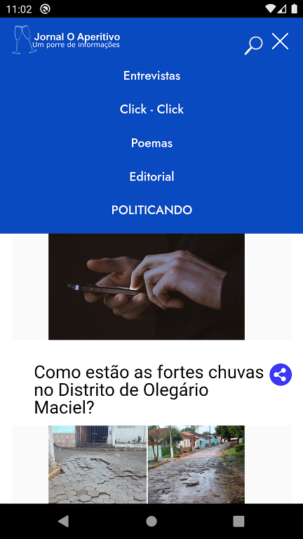

# JOA
leitor RSS do Jornal o Aperitivo, usando apache Cordova e Ajax 

usando o FeedBurner do Google eu recebo um XML de onde obtenho as dados da noticia como link, titulo, thumb e id 
depois insiro em uma lista de exibiçao para o usuario poder ter um rapido acesso as noticias

<h1>foto do tela principal do aplicativo</h1>

<h1>foto do menu do aplicativo</h1>

